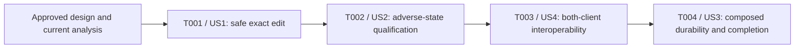

# Tasks: Exact Partial Editing for Project GDScripts

**Input:** [Specification](spec.md), [implementation plan](plan.md), [research](research.md), [data model](data-model.md), [Schema 2 interface](contracts/mcp-interface.md), [execution contract](contracts/execution.md) and [validation guide](quickstart.md) in `specs/008-exact-script-edit/`.

**Status:** Task derivation and granularity/coverage review complete: four pending implementation tasks. Consistency analysis and implementation have not run; no task is selected or completed.

**Prerequisites:** Granularity review is recorded below; run `/speckit.analyze` and obtain applicable design approval before implementation. Verify the active directory as `specs/008-exact-script-edit` rather than inferring it from a task branch. Select exactly one dependency-ready task, branch from updated `main` under repository policy, implement its full acceptance, review implementation shape, mark only that task complete, commit/push/open its PR, then stop. Dependent work waits for merge unless stacking is explicitly authorized; never auto-merge.

**Tests:** Required by this feature's US1–US4 independent tests, FR-017–FR-018, SC-001–SC-008 and constitutional mutation gates. Tests and documentation are bundled with their owning capability. Write meaningful behavioral cases before implementation and observe their relevant failing condition where practicable; do not create separate test-file PR tasks, pin description wording, or use mocks/acknowledgments as editor or real-agent proof.

**Organization:** Four tasks, one primary story per task. All stories are P1; execution order is **US1 → US2 → US4 → US3**, resolving the priority tie by dependency: complete the public path, qualify adverse behavior, establish both clients' interoperability, then exercise the composed workflow. US1 necessarily implements the safety and versioning mechanisms also used by US2/US4; later tasks do not authorize delaying those mechanisms. Setup/foundation already exist and final cross-cutting work belongs to the delivering task, not artificial PRs.

## Format and path conventions

Every implementation checkbox has a sequential ID, one `[USn]` label and exact repository-root-relative paths. Implementation steps, verbatim constraints (including tables), tests and acceptance within each story phase are binding parts of its checkbox's description. There are no task-level `[P]` markers: these tasks share the same public cutover and depend on earlier completed work. Intra-task parallel examples below are not additional Spec Kit tasks or permission to batch PRs.

Use the current Rust 1.98.1 / edition 2021 package and locked dependency graph, existing Python fixtures and VM relay. No new package, dependency, native/private-protocol revision, public core mode, framework, CI/approval gate or host-GUI fallback is selected. Read existing patterns and use LSP references before exported-symbol changes. Complete-source local Rust/CLI/private interfaces and Feature 007 history remain unchanged.

## Phase 1: Setup — reuse the existing project

**Goal:** Reuse the delivered package, three-tool adapter, native transactions, source validator, authentication/confinement and dedicated VM.

No setup checkbox. The existing `mcp-server/Cargo.toml`, `mcp-server/rust-toolchain.toml`, `godot-addon/tests/run_in_vm.py` and `.github/LOCAL_VM.md` already provide initialization and the supported execution boundary. T001 includes only the feature-specific integration/fixture changes its complete consumer needs. Do not add dependency-installation, directory-creation, configuration or helper-only tasks.

**Checkpoint:** Existing foundations and the approved design are available; implementation prerequisites above still apply. Current product behavior remains Schema 1 until T001's complete cutover.

## Phase 2: Foundational — no separate prerequisite increment

**Goal:** Keep exact intent inside the existing trusted execution boundary without delivering an unused matcher or a second mutation engine.

No foundational checkbox. Checked exact values, overlap matching, retained-error reduction and shared dispatch are inseparable from T001's safe external edit capability and ship in that task. Existing whole-source execution and the two closed profiles are delivered prerequisites, not new feature tasks.

**Checkpoint:** There is no serial foundation PR before the first useful vertical slice. T001 must not expose exact editing before its required safety mechanisms and directly necessary evidence are complete.

## Phase 3: User Story 1 — Make One Exact Change Without Resending the Script (P1, MVP)

**Goal:** Deliver a complete safe Schema 2 read → localized edit → fresh read path on all three lifecycle profiles, with a real coding agent and independent whole-source witnesses.

**Independent test:** OMP 18.5.1 performs localized replacement, deletion and complete-empty-source replacement on clean open, clean cached-R closed and positively absent-R closed targets. Exact complete intended source, saved state, identity and admitted lifecycle are independently observed. Multiline/tab/Unicode, anchor-adjacent insertion and fully checked unchanged intent also work. Basic stale/dirty/match/input refusals cannot mutate or report false success.

- [ ] T001 [US1] Deliver the complete Schema 2 exact-edit vertical slice in `mcp-server/src/script_edit/request.rs`, `mcp-server/src/script_edit.rs`, `mcp-server/src/script_read.rs`, `mcp-server/src/runner/read.rs`, `mcp-server/src/mcp/handler.rs`, `mcp-server/src/mcp/schema.rs`, `mcp-server/src/mcp/output.rs`, `mcp-server/src/mcp/output/edit.rs` and `mcp-server/src/mcp/output/edit/projection.rs`; bundle behavioral/process tests in `mcp-server/src/mcp/output/tests.rs`, `mcp-server/tests/mcp_tools.rs` and `mcp-server/tests/mcp_transport.rs`, live/agent witnesses in `godot-addon/tests/mcp_lifecycle_acceptance.py` and `godot-addon/tests/fixtures/mcp/fixture_driver.gd`, the complete current-caller migration described below, and operating/evidence updates in `.github/LOCAL_VM.md` and `specs/008-exact-script-edit/quickstart.md`.

  **Dependencies:** Completed project foundations plus the approved/currently analyzed feature artifacts. No preceding implementation task. This task owns the whole product mechanism and safe public cutover, not only a successful match helper.

  **Tests first, within this task:** Add deterministic cases alongside the checked source/intent code for zero/one/multiple starts, overlapping `aa` in `aaa` and multibyte overlaps, exact case/space/tab/newline/Unicode spelling, beginning/middle/end, new text containing old text, deletion including all source, complete empty source, both-empty/equal intent, whitespace-only nonempty source, exact byte caps and combined overflow. Exercise the actual MCP process for catalog/envelope compatibility, strict old/new decoding, legacy-only/mixed/extra-mode refusal and no dispatch on malformed input. Baseline the missing Schema 2 behavior without re-running known failures merely to reconfirm them.

  **Implementation and integration:**

  1. Add the crate-private bounded/redacted exact pair beside `ReplacementSource`. Preserve `ScriptEditRequest::new` for actual whole-source consumers; add the planned crate-private exact constructor and private complete/exact enum. Do not widen visibility for hypothetical consumers or rename private whole-source wire fields.
  2. Use at most two `str::find` calls against borrowed complete current source. Start the second at the next UTF-8 character boundary after the first match start, not after the matched span. Handle empty old only by the complete-source-empty predicate. Check result size with checked arithmetic before one exact-capacity prefix/new/suffix construction; move owned new text when a complete replacement permits it. No normalization, match vector, prefix-table allocation, rescan of inserted text or new search dependency.
  3. Integrate into the one existing acquisition/revision gate and dispatch in `runner/read.rs`. Authenticate/confine/acquire, reject unavailable/dirty/stale state and mismatched revision before match diagnosis, freeze one capture, derive source and expected basis from it, and keep original clock/cancellation ownership. Never refresh the basis or switch admitted lifecycle to rescue the request.
  4. Implement the entire retained-error precedence contract now: a derivation failure privately selects exact-current-source unchanged execution; only independently verified unchanged with proven zero effects may reduce to the matching refusal. All actual safety/validation/race/timeout/cancel/disclosure/uncertain-effect results win. No changed-source authorization, setter/write/finalizer/history action or repair may occur on that diagnostic path. Successful derivation runs its full-source path once, without an extra no-op.
  5. Cut over the public decoder, three input/output schemas and every success/error envelope to the single Schema 2 contract. Keep `structuredContent` authoritative with one terse outcome/action summary. Add source-free `no_match`, `ambiguous_match`, `empty_old_string`, derived `invalid_source` at `stage: matching`, preserving checked mode/evidence/history/lifecycle and `fresh_read` action. Keep downstream validation/safety reasons and early acquisition refusals distinct; malformed fragments remain `invalid_arguments` before dispatch.
  6. Migrate all **current MCP** callers/prompts/assertions in `godot-addon/tests/mcp_peer.py`, `godot-addon/tests/mcp_lifecycle_acceptance.py`, `godot-addon/tests/mcp_failure_acceptance.py`, `godot-addon/tests/mcp_composed_acceptance.py`, `godot-addon/tests/mcp_preservation_acceptance.py`, `godot-addon/tests/mcp_interruption_acceptance.py`, `godot-addon/tests/mcp_validation_acceptance.py`, `godot-addon/tests/mcp_privacy_acceptance.py` and their directly affected `test_mcp_*.py` consumers. Use the scenario's actual read source/revision; do not add a production legacy translator or filesystem fallback. Inspect any MCP-serving portions of `godot-addon/tests/closed_script_acceptance.py` without changing its independent local-driver semantics. Current fixtures may use whole nonempty read source as an exact span to preserve an inherited scenario, but the new localized acceptance must not substitute that for small-span intent. Keep only intentional rejection tests sending legacy input.
  7. Preserve `mcp-server/src/bin/edit-gdscript.rs`, `mcp-server/examples/script_workflow_fixture.rs`, `godot-addon/tests/caller_edit_acceptance.py`, private `mcp-server/src/bridge/wire/edit.rs` and native whole-source interfaces as genuine separate consumers. Update current MCP guidance/migration in `.github/LOCAL_VM.md` and this feature's quickstart; do not rewrite Feature 007 contracts/evidence or the completed phase exits.
  8. Extend the existing `workflow`/`sources`/`bound` fixture owners and their independent before/after observers, not a new runner. Through the fixed VM relay, run OMP's actual Schema 2 positive workflow across all three profiles, with localized replacement, deletion, empty→nonempty, nonempty unchanged and empty→empty. Exercise multiline/tab/Unicode and anchored insertion boundaries, then the existing workflow durability continuation. Record model-visible source/revision/result use and complete-source/lifecycle witnesses, not just raw SDK events or prompts.

  **Binding entity/field constraints (verbatim from data-model.md; also apply to T002–T004):**

| Entity | Fields / relationship | Validation and ownership |
| --- | --- | --- |
| Public exact edit arguments | `project_root`, `script_path`, `revision`, `old_string`, `new_string`; optional `session_id` | One strict MCP object, no mode or legacy field. Decoder checks types, selectors, revision syntax and fragment bounds/representation. |
| Exact replacement intent | Owned bounded `old_string` and `new_string` | Crate-private checked core value; redacted Debug/errors. Empty old is syntactically valid but requires a fresh empty complete source. Fragments are not standalone scripts. |
| Revision-based request | Checked observation selectors/request ID, opaque `ScriptRevision`, private source-intent enum | Existing public whole-source constructor remains for local consumers; crate-private exact constructor serves MCP. Enum has only `Complete(ReplacementSource)` and `Exact(ExactReplacement)` or equivalent names, not public wire modes. |
| Fresh trusted capture | Existing observation plus open basis or closed supplement, revision, interval and permitted source | Authenticated/confined acquisition; unknown, invalidated or dirty state cannot become admissible merely because text matches. One frozen capture supplies source and expected basis. |
| Derived complete source | One owned `ReplacementSource` containing prefix + replacement + suffix, or exactly new text for empty complete source | Existing full-source byte/representation bounds apply; existing workers perform script/context admission and required validation. Outside bytes are unchanged. |
| Derivation failure | Typed `NoMatch`, `AmbiguousMatch`, `EmptyOldString`, `InvalidSource` | Request-local, source-free, withheld until applicable unchanged safety/verification succeeds. It has no candidate/source/offset/count payload. |
| Checked execution result | Existing open/closed result or earlier acquisition refusal | Preserves stage, application, evidence, validation, dirty/synchronization/history/lifecycle and disclosure. Only proven zero-effect unchanged may be reduced to a retained derivation refusal. |
| Public tool envelope | `schema_version: 2`, `operation`, `request_id`, `result`, `error` | Exactly one of result/error non-null. Nested existing local versions keep their own meanings. |

  **Binding size/representation/state bounds (verbatim from data-model.md):**

| Value | Bound / interpretation |
| --- | --- |
| Project/script/session selectors | Retain 1024-byte project root, 2048-byte resource locator and optional 32-lowercase-hex session ID rules. |
| Revision | Retain opaque `sr1:` plus 64 lowercase hex. No reissue or renumbering merely because the public schema changes. |
| Each decoded fragment | At most 524288 UTF-8 bytes, LF representation; reject NUL, CR and U+FEFF without normalization. Empty strings are values, not missing data. |
| Original and complete intended source | Retain 524288-byte independent-authority/result limits and existing source/context admission. Bounds are bytes, not JSON Schema character counts. |
| Public framing/output | Retain 16 MiB complete input frame/tool object, 64 MiB complete response, depth 64, bounded IDs and strict duplicate/unknown handling. Existing inner worker bounds remain separate. |
| Work and delivery | Read/discover 5 seconds, edit 10 seconds; existing 4.5/9.5-second work cutoffs. Matching, refusal safety checks, validation, serialization and consumed delivery use the original clock. |
| Retained state | Only current strings, one capture, one derived source or pending error and existing attempt state; at most two substring searches, no match collection. |

  > The two fragment caps do not expand the complete-source cap. A pair of individually valid fragments may produce an over-bound source and must refuse before effects. Admissible empty source means a complete, observed, safe existing script; whitespace, missing files, unavailable source, empty B with nonempty D/R or incomplete acquisition do not qualify.
  >
  > Empty old text has exactly one interpretation: if complete current source is empty, intended source is exactly new text; otherwise `EmptyOldString`. No file creation, zero-length position matching, implicit prepend/append or lifecycle change follows.
  >
  > Equal old/new text still requires unique matching or the complete-empty-source condition. It then uses existing fully validated/independently verified unchanged execution. Finding new text without old text is not success. No trim, case folding, newline conversion, final newline insertion, Unicode normalization, reindentation, fuzzy/regex/AST matching or occurrence selector exists.
  >
  > A match refusal has `outcome: refused`, `application: not_applied` and no source/history/lifecycle effects; its successful no-effect assessment is not published as an edit success.

  **Public-field acceptance:** Required edit fields are exactly `project_root`, `script_path`, `revision`, `old_string`, `new_string`; only `session_id` is optional. All are strings, explicit null is invalid, selectors are nonempty, and empty fragments remain permitted structural values. Enforce session `^[0-9a-f]{32}$`, revision `^sr1:[0-9a-f]{64}$`, strict duplicate/unknown rejection and `additionalProperties: false`. No fragment `minLength: 1`, mode flag or `oneOf` legacy schema. Only the root MCP surface becomes 2; protocol 2025-11-25, `sr1`, local v1, bridge v6, native revision 4 and package 0.1.0 remain unchanged.

  **Matching-refusal projection acceptance:** For each new matching reason, assert the actual projected/serialized `outcome: refused`, `application: not_applied` and MCP `isError=true`, alongside stage, permitted evidence and no-effect witnesses. The internal unchanged assessment must never escape as successful edit recognition. Preserve actual non-success/effect certainty instead of these matching fields whenever the diagnostic path fails or becomes uncertain.

  **Required acceptance:** Complete US1.1–US1.8; prove basic no/multiple/overlap/empty-search refusals, stale-even-if-old-still-matches, dirty B and equal-text dirty R precedence, missing evidence, invalid combined source and the legacy/mixed cutover without effects. Include a late guard failure while a match error is retained, rather than only pure matcher tests. Independently observe same-document complete D/R/B and saved state for open, D/R plus continuing absence for cached closed, and D plus positive R/B absence for uncached closed. Exercise a focused real native open Undo/Redo/prior-history witness and later Save/reopen/reparse/rescan/fresh-runtime durability through the changed path; T004 owns the full stateful sequence, not permission to omit directly necessary guarantees here. The task may not complete with basic safety deferred to T002 or caller migration deferred to T003. Apply the common verification/completion rules below and record evidence in the quickstart. Full two-client/feature acceptance is not yet claimed.

**Checkpoint:** A useful, safe and independently witnessed public exact-edit capability exists with OMP acceptance; every current MCP caller speaks Schema 2. T002 qualifies the broader adverse-state matrix, T003 completes the two-client interoperability story and T004 establishes composed/cumulative acceptance.

## Phase 4: User Story 2 — Refuse an Unclear or Outdated Change (P1)

**Goal:** Qualify the new exact-intent and retained-error paths against the specified adverse states, including truthful interruption and disclosure, and fix any reachable regressions within that boundary.

**Independent test:** Actual Schema 2 calls combine match/no-match/ambiguity/empty-source intent with dirty, stale, divergent, unavailable, identity/lifecycle, confinement and interrupted-effect cases. Independent before/after state and operation outcomes show preservation, safety-reason precedence, no source leakage and no fabricated effect certainty.

- [ ] T002 [US2] Complete adversarial exact-edit preservation and effect/disclosure qualification in `godot-addon/tests/mcp_preservation_acceptance.py`, `godot-addon/tests/mcp_interruption_acceptance.py`, `godot-addon/tests/mcp_validation_acceptance.py`, `godot-addon/tests/mcp_privacy_acceptance.py`, `godot-addon/tests/mcp_failure_acceptance.py` and `godot-addon/tests/fixtures/mcp/fixture_driver.gd`; bundle affected consumer tests in `godot-addon/tests/test_mcp_failure_acceptance.py` and `godot-addon/tests/test_mcp_privacy_acceptance.py`, focused regression corrections/tests in `mcp-server/src/runner/read.rs`, `mcp-server/src/mcp/output/edit/projection.rs` and `mcp-server/src/mcp/output/tests.rs`, and source/provenance/evidence updates in `specs/008-exact-script-edit/quickstart.md`.

  **Dependencies:** T001 complete and its PR merged, unless explicit stacking authorization applies. T001's full safety implementation is a prerequisite; this is one meaningful adversarial qualification increment, not a deferred protection or separate task per scenario.

  **Tests → corrections → independent evidence:**

  1. Extend the existing individually runnable preservation/validation groups for US2.1–US2.8: no match even if new text already exists; overlapping/multiple ambiguity; exact case/whitespace/indent/newline/trailing-space/canonically equivalent Unicode nonmatches; stale source and same-text revision/version/file/Resource/document/session/lifecycle changes with old text unique, missing or ambiguous; stale empty source whose other bound facts changed; dirty/equal-text-dirty B or R, stale/divergent authorities, missing getters, denied/escaping/missing targets, ambiguous/ended sessions and unsupported source/context. Verify all required source/history/dirty/saved/identity/lifecycle preservation, not only reason strings.
  2. Cross absent/ambiguous/empty-old/derived-overflow failures with preparation-only safety checks, then invalidate saved/Resource/context/lifecycle evidence during the unchanged diagnostic check. Exercise cancellation/deadline there. Only a verified zero-effect unchanged check may expose the retained matching reason; any failure/unknown effect and sticky disclosure decision must win. Confirm no setter/write/history/saved-state effect occurs on diagnostic checks. Do not run the full Cartesian product when boundary-equivalent focused cases establish the required precedence.
  3. Cover fragment and complete-source validation/byte boundaries, all-source deletion, whitespace-only nonempty source, empty-to-invalid/over-bound source and unavailable/divergent “empty” surfaces. Assert complete-source validation, not fragment parser validity or truncation. Exercise near-match repetitive maximum-bound strings under the original request clock.
  4. Extend the affected pre/post-effect interruption cases for US2.9 and US3.4: cancel, timeout, disconnect, lost/blocked response and newer human work after possible entry. Preserve known/partial/unknown effects and ownership; do not infer rollback, definite non-application, later no-match, automatic retry or safe replay. Use direct protocol cases for actual wire cancellation and OMP's actual `failures`/`reconnect` profiles for model-visible uncertainty and fresh-read recovery; client-local cancellation is not a wire event.
  5. Extend source/disclosure sentinels to old/new fragments, derived complete source and match errors through normal/error/denied/late-failure paths. Preserve existing permitted read output and source-free execution evidence without candidate matches, offsets/counts, snippets, raw requests, private routing/validator facts or unredacted Debug. Qualify relevant error projections rather than broadening privacy requirements or adding a logging layer.
  6. Fix only reachable failures attributable to the selected exact-intent/projection/fixture boundary, with failing-before/passing-after focused regressions. T001 already migrated all request shapes; do not create dual-mode compatibility or rewrite independent local whole-source APIs. Record every changed boundary and its affected cases when deciding whether earlier evidence remains valid.

  **Binding transition/effect constraints (verbatim from data-model.md; T001's field and bound tables still apply):**

  > **Existing execution:** a valid derivation uses its intended source. A failed derivation uses the exact frozen current source only for the existing unchanged safety/validation/verification path. Both retain the same capture-derived expected basis and original budget; neither refreshes the basis or switches lifecycle.
  >
  > **Terminal:** propagate every safety/validation/disclosure/effect failure. A normal valid intent retains the existing verified-changed/unchanged result. A pending derivation failure may replace **only** independently verified unchanged with zero effects, producing a refusal and retaining actual evidence/lifecycle/history.
  >
  > Open history is not participated for a diagnostic check; closed B/history are not applicable only where absence is positively established. Unknown final state is never preserved-lifecycle proof.
  >
  > After possible effects, only actual known/partial/unknown facts govern. No rollback, replay, automatic retry, queue, compensation or definite non-application is inferred from a timeout or lost response.
  >
  > Denied/unavailable disclosure is sticky through projection and output failure. A retained match error cannot restore a revision, target or other source-derived fact that a later safety result suppresses.

  **Required acceptance:** US2.1–US2.9 and the affected US3.4 uncertainty path have newly executed exact-path evidence, with complete state witnesses and actionable results. OMP actually consumes failure/effect information and begins recovery with a fresh read of the original explicit target. No unsafe overwrite, false no-op success, source-bearing match feedback or effect reclassification is accepted. Select affected `preservation`, `interruption`, `privacy-export` cases and their existing validation owner; unchanged exports/native/local-operation coverage may be reused only after relevant-input review. Follow the common verification and completion rules, including task-owned evidence and current-task shape review.

**Checkpoint:** Exact-intent errors and adversarial/race/interruption paths have independently witnessed safety and disclosure behavior; no task treats a matching failure as permission to bypass a safety outcome.

## Phase 5: User Story 4 — Use One Clear, Versioned Editing Contract (P1)

**Goal:** Establish the selected two-client compatibility and qualitative interface usability of the single delivered Schema 2 contract, including explicit refusal recovery and migration uptake.

**Independent test:** Codex CLI 0.153.4 and OMP 18.5.1 use refreshed discovery and actual returned source/revision to perform localized replacement, deletion and complete-empty-source replacement on all three profiles. At least one actual workflow freshly reads and corrects both no-match and ambiguity. Current callers reject legacy/mixed forms; no custom grammar, private-architecture coaching or shell/file substitution is needed.

- [ ] T003 [US4] Complete real Codex/OMP Schema 2 interoperability and migration acceptance in `godot-addon/tests/mcp_lifecycle_acceptance.py`, `godot-addon/tests/mcp_failure_acceptance.py`, `godot-addon/tests/test_mcp_lifecycle_acceptance.py` and `godot-addon/tests/test_mcp_failure_acceptance.py`; make only demonstrated client-facing corrections in `mcp-server/src/mcp/schema.rs`, `mcp-server/src/mcp/output.rs`, `mcp-server/src/mcp/output/edit/projection.rs` and `mcp-server/tests/mcp_tools.rs`, and update current guidance and acceptance records in `.github/LOCAL_VM.md` and `specs/008-exact-script-edit/quickstart.md`.

  **Dependencies:** T001–T002 complete and delivered under the sequencing rule. Public contract/caller migration is already complete in T001; this task is actual second-client interoperability, recovery and usability qualification, not delayed schema implementation or a wording-only review.

  **Implementation and evidence:**

  1. Extend the existing prompt/result consumer/witness paths to recognize genuine new-representation calls, exact complete results and intentional recovery. Add behavior tests that reject wrong/missing revisions, whole-source substitutes for required localized edits, claimed-but-unrecorded tool calls, incorrect before/after source or lifecycle, and synthetic recovery. Do not test copied prompt wording or merely count calls.
  2. Run Codex 0.153.4 through the unchanged fixed VM stdio relay with normal per-call interactive approval; keep credentials on the host and project trust invocation-scoped. It must complete replacement, deletion and empty-source replacement across open/cached-R/absent-R profiles, then fresh reads and applicable later-opening durability. It must actually consume truthful failure/effect/action results, using affected `failures`/`reconnect` scenarios as applicable. SDK calls or model assertions alone cannot establish compatibility.
  3. Establish the same positive and truthful failure/result coverage for OMP 18.5.1. T001/T002's actual **Schema 2** evidence is reusable if all relevant implementation, prompt/consumer/witness, environment and acceptance inputs remain valid; do not repeat unchanged positives simply because T003 has a new head. Any necessary corrections invalidate only their affected client/profile evidence. Prior Feature 007 Schema 1 passes cannot satisfy this obligation.
  4. In at least one selected actual client's workflow, intentionally obtain both `no_match` and `ambiguous_match`; require a fresh read and a separate corrected/larger unique-span request after each. Correlate model-visible outcomes and subsequent source/revision use with server records and independent witnesses. An automatic retransmission is not this recovery. Model-facing result spill/recovery must actually provide the required fields without new full-object duplication.
  5. Inspect ordinary refreshed `tools/list` and delivered output schemas/envelopes for exactly three tools and Schema 2; exercise legacy-only, mixed and unsupported-mode requests without dispatch. Check all current repository MCP callers/examples/instructions for the delivered representation, excluding deliberate negative tests and genuine independent local whole-source interfaces/history. Do not require unrelated local interfaces to migrate.
  6. Evaluate the concise descriptions/parameter constraints and outcome-time guidance through actual agent choices and recovery. Correct only demonstrated sufficiency problems while retaining current revision, uniqueness/overlap, complete-empty-source rule, deletion, lifecycle and safe actions. No internal terminology, exhaustive failure lecture, numeric word/token budget or new carrier/configuration framework. Keep migration instructions explicit: refresh catalog, update root schema expectation, fresh read, one pair, no stale-request translation/fallback/retry.

  **Required acceptance:** All US4.1–US4.4 and both-client obligations in SC-001/SC-007 and FR-017 are satisfied by valid actual Schema 2 evidence. Preserve the exact [model constraints](data-model.md), T001's quoted field/bound rules, structured/error/effect meaning and approved support profile. Report selected executable/model/config provenance, actual call/result correlation and applicable independent state/durability. The feature still needs T004's full composed interaction; interoperability is not feature/release completion. Apply the common verification and completion rules without replaying unaffected historical GUI campaigns.

**Checkpoint:** Both selected clients can use the one clear versioned contract and interpret successes, refusals and uncertainty; actual fresh-read correction of missing/ambiguous intent is demonstrated.

## Phase 6: User Story 3 — Keep Native History and Durable Results (P1)

**Goal:** Establish the new stateful real-agent A–E interaction and complete cumulative valid-evidence coverage, not merely add independent positive counts.

**Independent test:** At least one selected real coding-agent conversation interleaves twenty fresh-revision exact edits across open/cached/absent profiles with dirty, stale, no-match and ambiguous refusals. Real native Undo/Save/Redo/Save and prior history, lifecycle/durability challenges, truthful interrupted-result recovery and independent whole-source witnesses prove no lost intended or human work.

- [ ] T004 [US3] Complete composed exact-edit native history, sequential preservation and durability acceptance in `godot-addon/tests/mcp_composed_acceptance.py`, `godot-addon/tests/test_mcp_composed_acceptance.py` and `godot-addon/tests/fixtures/mcp/fixture_driver.gd`; integrate only necessary existing group selection in `godot-addon/tests/run_mcp.py`, make directly implicated regression corrections in the owning production module identified by the failing case, and record cumulative evidence, current-task shape review and feature completion in `specs/008-exact-script-edit/quickstart.md`, `specs/008-exact-script-edit/plan.md`, `specs/008-exact-script-edit/tasks.md` and `PROJECT_STATUS.md`.

  **Dependencies:** T001–T003 complete and delivered under the sequencing rule. This is the one final composed/cumulative capability increment; ordinary task documentation, shape cleanup and bookkeeping are included, not extra tasks.

  **Tests → composition → evidence:**

  1. Extend the existing composed fixture and result consumer for actual localized old/new intents, exact fresh revisions and complete independent expected-source comparisons. Test that the consumer rejects stale/incorrect sequence state, missing native history or pre-Save witnesses, closed-state “proof” obtained only after opening, simulated Undo/Redo and uncorrelated model claims. Keep owned native/fixture actions distinct from public tools and preserve terminal cleanup.
  2. Drive `prepare-mcp --profile composed` through at least one of the now-qualified actual clients. Retain the existing twenty-successful-edit sequence across all three profiles, with the existing at least three dirty and three stale refusals, and add no-match and ambiguous refusals plus intentional fresh-read correction. Every successful intentional edit uses a freshly read revision; no automatic retry, queued operation or alternate writer. The sequence must include the new representation's interaction with previously accepted edits/refusals rather than replay independent groups under an `all` label.
  3. Independently witness A/B clean-open complete D/R/B and human-work refusal, C genuine native Undo → Save → Redo → Save plus reachable pre-existing history, D close/reopen or later opening after already-verified closed success, and E repeated preservation without lifecycle switching or lost changes. Challenge applicable Save, reparse, rescan and fresh runtime durability without human reconciliation. Positively absent R/B remain absent during closed success; active-game/cached-class hot reload is outside support.
  4. Correlate model-visible outcomes/subsequent reasoning with actual server arguments/results, native/fixture observations and consumed-output timings. Reuse T002/T003's valid interrupted-effect and client recovery evidence for US3.4; newly execute any stateful interruption interaction actually introduced by composition. A suppressed/lost response remains undelivered, never a client-visible success or rollback guarantee.
  5. Assemble the final requirement/scenario disposition below using new, valid reused, invalidated-and-rerun or substantively inapplicable evidence. Review source/binary/native/ABI/fixtures/witness/runner/environment provenance, not just version strings. Record limitations and excluded failed/interrupted runs. Do not run a complete historical GUI or release campaign simply to accumulate counts.
  6. Perform proportionate shape/constitutional review and simple current-task cleanup before marking this task complete. Confirm every FR/SC and scenario has valid evidence, all current MCP callers/docs remain migrated, the feature retains its support/export/privacy boundaries and no requested acceptance remains unmet. Mark T004 and Feature 008 complete only then; keep PR delivery state separate and leave Phase 3 closure/Phase 4/release decisions unchanged.

  **Required acceptance:** US3.1–US3.4, applicable real-agent A–E, the approved twenty-edit composed interaction and full cumulative coverage are satisfied. All new work stays within the original five/ten-second supported-condition bounds and original work cutoffs. T001's field/state/bound quotes remain binding, especially no invented closed history, no lifecycle repair and no false effect certainty. Execute newly introduced composed behavior plus directly affected regressions and applicable checks only; retained evidence is reusable after the documented relevant-input review. Final completion does not authorize another feature or automatic merge.

**Checkpoint:** All four stories and the complete feature have valid acceptance and implementation-shape/constitutional evidence. Publish this task's PR and stop; no release or Phase 4 work follows automatically.

## Phase 7: Polish and cross-cutting concerns — bundled, not another PR

No polish checkbox. Every task owns its directly necessary tests/docs, failure fixes, evidence provenance, relevant-input reuse review, explicit limitations and proportionate shape cleanup before completion. T004 owns final cumulative coverage and feature lifecycle bookkeeping. Do not create a separate “add docs,” “run all tests,” “security hardening” or status-only task, or defer an unmet criterion as cleanup.

## Dependencies and execution order

Edges require the prerequisite task's acceptance and, separately, the repository's merge/explicit-stacking delivery authorization. This graph is not permission to implement multiple tasks in one invocation. US4 shares schema/cutover mechanisms with US1 but adds its own actual two-client/qualitative acceptance; US3's full composed conversation follows those qualified clients. Each story has the independent test above; they are not asserted to have independent implementations on the same shared code.

### Parallel opportunities by story

No whole task is independently runnable in parallel with another pending task; therefore none is marked `[P]`. Within the **one selected task**, an integration owner may use these independent slices after interfaces are fixed, then integrate and run the affected checks once. Guest GUI/client runs remain serial on the shared owned VM.

| Story / task | Parallel example within that task | Required boundary |
| --- | --- | --- |
| US1 / T001 | One worker implements the checked matcher/request seam in `mcp-server/src/script_edit/request.rs`; another migrates fixture request construction in `godot-addon/tests/mcp_peer.py` against the already specified Schema 2 shape. | Parent owns `script_read.rs`, runner/adapter integration and shared fixtures; helpers use the fixed contract, not an unreviewed API guess. Do not delegate integration-dependent edits until that seam is fixed. |
| US2 / T002 | One worker extends preservation cases in `godot-addon/tests/mcp_preservation_acceptance.py`; another extends source-disclosure assertions in `godot-addon/tests/mcp_privacy_acceptance.py`. | Keep shared `fixture_driver.gd`, runner and result projection changes with the integration owner; collect both results before integration/verification. |
| US4 / T003 | One worker updates actual-client result/recovery acceptance in `godot-addon/tests/mcp_failure_acceptance.py`; another reviews migration accuracy and concise guidance in `.github/LOCAL_VM.md` against the fixed contract. | Do not pre-judge runtime usability or change public wording from a pending client result; actual Codex and OMP sessions run serially with normal approvals. |
| US3 / T004 | One worker extends composed-sequence assertions in `godot-addon/tests/mcp_composed_acceptance.py`; another independently reviews historical evidence provenance for `specs/008-exact-script-edit/quickstart.md`. | The integration owner writes shared evidence/lifecycle documents only after results; provenance review cannot pre-certify changed composed behavior. |

These are execution examples, not additional checklist tasks or authorization to bypass merge, approval, VM ownership or no-polling rules.

## Common verification and completion rules

1. Use deterministic pure tests for matching/size/transition boundaries, actual MCP process tests for schemas/carriers/decoding, and independent live-editor VM witnesses for source/history/lifecycle/effects. Both selected clients owe real model-visible Schema 2 use; a direct protocol/SDK fixture is not real-agent acceptance.
2. Follow [quickstart](quickstart.md) and [TEST_POLICY.md](../../TEST_POLICY.md). During development run failed/affected cases first. Rust-affecting completion normally runs `cargo fmt --all -- --check`, `cargo clippy --all-targets --locked -- -D warnings`, `cargo test --locked`, `cargo doc --no-deps --locked` and actual consumer builds from `mcp-server/`; include doctests and approved feature combinations, not blanket all-features/workspace assumptions. Tooling-only tasks run affected Python/consumer/selection checks; unchanged product baselines remain reusable according to policy.
3. Real-editor acceptance uses `godot-addon/tests/run_in_vm.py`, committed inputs, exact official Godot 4.7.2/macOS 26.6.2 arm64 four-vCPU/6-GiB support and the existing fixed prepare/relay/durability/finalize commands. Preserve personal settings, ordinary client approvals and credentials; no host fallback, private bridge substitution or relaxed support claim.
4. Native rebuilds/loading/ABI tests apply only when relevant native/build inputs changed or equivalent accepted provenance cannot be established. Extend export/disclosure witnesses when relevant; unchanged enabled/disabled/hook-only export evidence may be reused. Failed/interrupted/unverified records are never passes.
5. Broaden evidence only for an owned interaction or a documented changed behavior/boundary, named affected suite(s) and concrete reachable invalidation. Editing a shared file, changing a fixture registration or reaching a new PR head is not itself a reason to replay historical suites. T004's new composed state transition is required, not a blanket `all` campaign.
6. Every task must review coherent production-module responsibility, required visibility, genuine current consumers, lifecycle representation, recoverable evidence failures and needless abstractions. Apply simple current-task responsibility cleanup before completion; no unrelated refactor or generic framework. Verify full acceptance before marking `[X]`, independent of PR review state; publish one focused task PR and stop.

## Coverage and completion ownership

| Approved scenarios | Primary completion owner | Supporting already-owned behavior |
| --- | --- | --- |
| US1.1–US1.8 | T001 | T003 completes both-client coverage; T004 adds repeated/history/durability composition. |
| US2.1–US2.9 | T002 | T001 must already enforce every mechanism and prove basic positive/refusal/precedence boundaries; T003 adds client correction uptake. |
| US4.1–US4.4 | T003 | T001 owns the atomic schema/caller migration and contract rejection; T002 supplies adverse outcome foundations. |
| US3.1–US3.4 | T004 | T001 supplies directly required history/durability, T002 interruption, and T003 real-client interpretation; T004 owns the new stateful interaction. |

| Requirements | Completion coverage |
| --- | --- |
| FR-001–FR-002 | T001 public catalog/request/read-edit path; T003 both-client usability/migration. |
| FR-003–FR-010 | T001 complete trusted transformation/guard/lifecycle mechanism; T002 adverse and boundary qualification; T004 composed preservation. |
| FR-011–FR-013 | T001 faithful structured outcomes/retained-error reduction; T002 effects/disclosure/races; T003 actual-client safe interpretation. |
| FR-014–FR-015 | T001 clean current-caller cutover and concise catalog; T003 actual migration uptake and qualitative sufficiency. |
| FR-016 | All tasks retain source/environment/timing/resource/export boundaries; T004 accounts for cumulative validity. |
| FR-017–FR-018 | T001 OMP vertical proof, T002 adverse evidence, T003 both selected clients, T004 new composed A–E plus valid cumulative coverage. |
| SC-001–SC-002 | T001 exact transformations/all profiles; T002 complete match/boundary cases; T003 both-client acceptance. |
| SC-003–SC-005 | T001 baseline safety, T002 adversarial/effect/disclosure, T004 native history/durability/sequential composition. |
| SC-006–SC-007 | T001 one Schema 2 catalog/shape/caller cutover; T003 migration/recovery/model-visible sufficiency. |
| SC-008 | Each task owns its affected original-clock/timing evidence; T004 records every inherited/new requirement disposition. |

Entity ownership is likewise explicit: T001 implements the exact arguments/pair, private request variant, fresh capture relationship, derived complete source, typed derivation failure and Schema 2 envelope; T002 qualifies checked-result/effect/disclosure transitions; T003 validates their public/model-facing interpretation; T004 validates the stateful lifecycle/history composition. No data-model entity or contract needs a separate file/symbol task.

## Granularity and constitutional review

**Disposition: PASS, 2026-10-06.** Independent granularity and requirement/constraint reviews found four meaningful PR-sized increments with complete acceptance ownership. One coverage finding was corrected before publication: T001 now quotes the model's exact refused/not-applied constraint and explicitly asserts those serialized fields plus MCP `isError=true`. No unresolved material granularity or coverage issue remains. This is task-list review, not `/speckit.analyze`, an analysis attestation, maintainer approval or implementation acceptance.

The review confirmed:

- T001 delivers the first useful vertical slice without prior setup/model/dependency-only PRs; its entire safety mechanism and current-caller cutover are inseparable.
- T002 adds substantive adverse-state/effect/disclosure qualification, T003 establishes actual second-client interoperability/recovery, and T004 owns the newly composed native-history/durability interaction. None is a file-only, wording-only or bookkeeping task.
- Tests, operating guidance, relevant failure fixes, evidence and shape cleanup are bundled with their capability. Final cumulative lifecycle updates belong to T004, not a separate polish PR.
- All 25 scenarios, 18 FRs and eight SCs have actionable completion ownership, with constrained model fields/bounds quoted in binding descriptions. Both clients and all three lifecycle profiles remain required.
- All stories are P1; qualifying the second client before the final composed interaction justifies US4-before-US3. There is no false task-level parallelism or bypass of one-task-one-PR sequencing.
- Focused/new behavior and valid evidence reuse govern test scope. No blanket historical GUI/release campaign, automatic native rebuild, new CI topology or approval gate was introduced.
- Constitutional I–IV retain independent full-source coherence, human-work protection, native history and verified/effect-sensitive outcomes; V–VIII/X–XII retain confinement, actual editor proof, protocol/tooling separation, truthful disclosure and independent implementation; IX retains the lean three-tool contract; XIII rejects extra infrastructure and artificial PR ceremony. No constitutional exception or design-semantic change is selected.

## Implementation strategy

**MVP scope:** T001 / US1 is the first useful implementation increment: complete safe Schema 2 exact editing and OMP positive evidence on all three profiles, including deletion/empty/unchanged cases and required safety/versioning/history/durability checks. It necessarily includes US2/US4's protective and contract mechanisms. This is not permission to drop T002–T004, claim both-client/feature completion or designate a release.

**Incremental delivery:** Finish and publish T001, stop for review/merge; then, only when authorized, select T002, T003 and T004 in dependency order, each with its own acceptance/evidence/PR. Every stage retains earlier guarantees and resolves its own failures before completion. No implicit implement-all or cross-task batching follows from this file.

**Generation boundary:** This command creates tasks and performs granularity/coverage review only. The next requested design command is `/speckit.analyze`; do not fabricate `analysis.md`, mark a task complete, start implementation, change support, merge the design PR or begin another feature.
